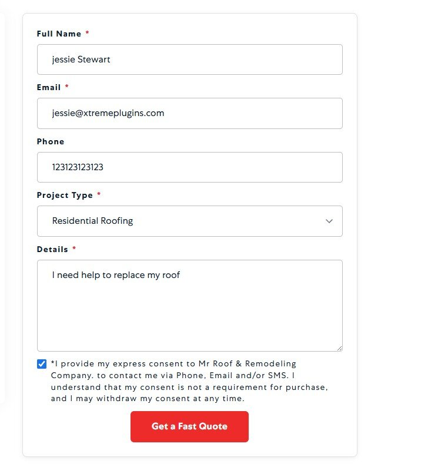
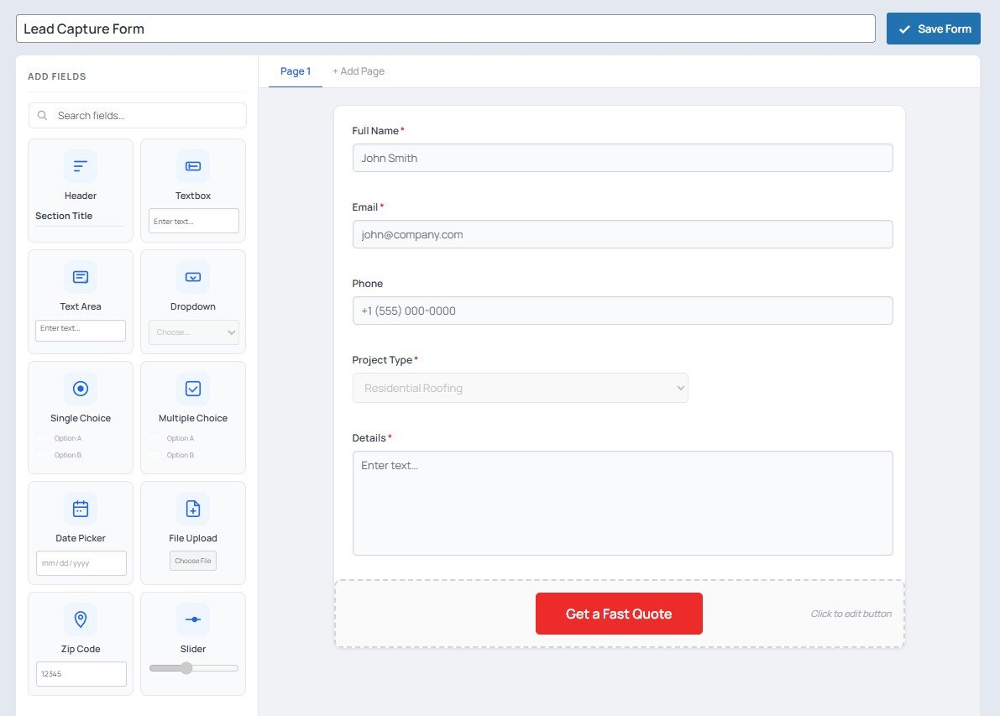
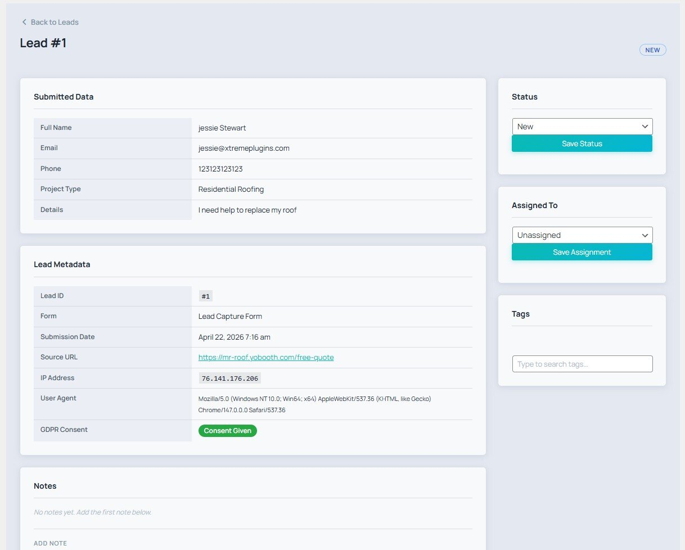
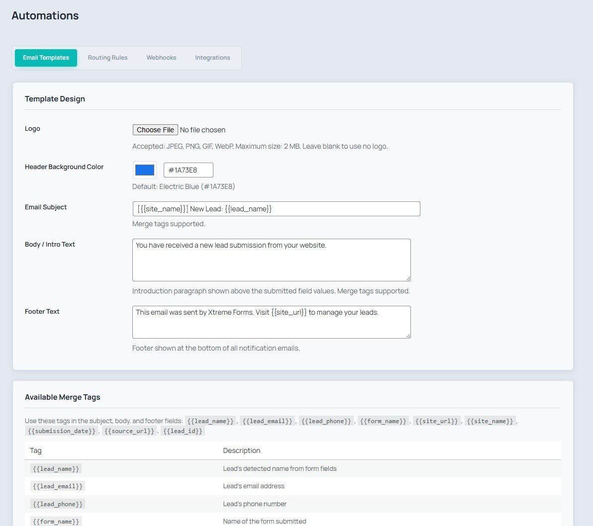
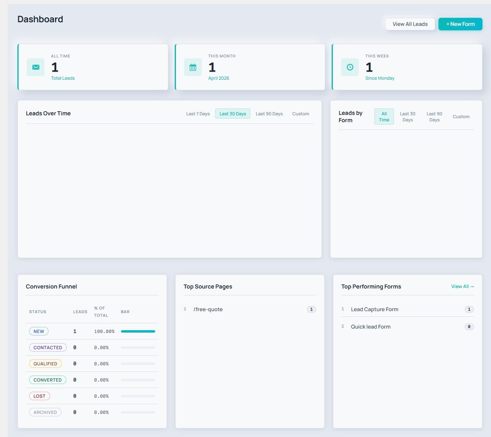

<h1 align="center">
  
</h1>

<p align="center">A modern WordPress lead capture plugin — drag-and-drop form builder, lead inbox, email routing, webhooks, analytics, and GDPR tools. Built for teams that actually work their leads.</p>

<p align="center">
  
  
  
  
  
</p>

<p align="center">
  <a href="https://xtremeplugins.com/plugins/xtreme-forms"></a>
  &nbsp;&nbsp;
  <a href="https://xtremeplugins.com/plugins/xtreme-forms"></a>
</p>

---

## Screenshots

### Frontend form — your users see this
<p align="center"></p>

Published form with GDPR consent checkbox, custom-styled submit button, and the clean public layout your visitors interact with.

### Form Builder — drag, drop, done
<p align="center"></p>

Build multi-page forms by dragging fields from the palette. 10 field types, live canvas preview, per-field width (Full / 1/2 / 1/3 / 1/4), editable submit button, and the new **Styling** tab for a background-free look.

### Lead Detail — the full story of every lead
<p align="center"></p>

Every submitted field, source URL, IP, user agent, GDPR consent, status, assignment, tags, and a notes timeline — in one scannable view.

### Automations — email, routing, webhooks, integrations
<p align="center"></p>

Brandable email templates with logo, header color, and merge tags (`{{lead_name}}`, `{{form_name}}`, etc.). Tabs for Routing Rules, Webhooks, and Integrations.

### Dashboard — analytics you'll actually check
<p align="center"></p>

All-time / monthly / weekly totals, a leads-over-time chart, leads-by-form breakdown, conversion funnel, top source pages, and top performing forms.

---

## Why Xtreme Forms

- **Fast by default** — no jQuery on the frontend, vanilla JS, conditional asset loading, zero external dependencies.
- **Your data stays yours** — everything is stored in your own WordPress database. No phone-home, no telemetry, no account required.
- **Lead-focused, not form-focused** — a form plugin that treats a submission as a *lead* with a timeline, status, notes, tags, and an audit trail — not just an inbox row.
- **Modern admin UI** — built from scratch for WordPress 6.0+ with a clean, minimal look that feels like part of the admin (not a bolted-on app).
- **Multisite-ready** — per-site tables, network activation, new-blog provisioning baked in.

---

## Features

### Core (Free)

| | |
|---|---|
| **Form Builder** | 10 field types (textbox, textarea, dropdown, single/multiple choice, date, file upload, zip code, slider, header) with drag-and-drop reorder, multi-page forms, per-field required / placeholder / default value / width |
| **Layout Control** | Float toggle + width presets (Full / 1/2 / 1/3 / 1/4) per field; inline Submit button; optional transparent wrapper via Styling tab |
| **Lead Inbox** | Searchable, filterable list with status workflow (new → contacted → converted → archived / spam), bulk actions, tag filters |
| **Email Notifications** | Route to different recipients based on field values; configurable subject and body with merge tags |
| **Auto-Responder** | Branded confirmation email to the submitter immediately on capture |
| **Email Templates** | Reusable templates with logo, header color, merge tags: `{{lead_name}}`, `{{lead_email}}`, `{{form_name}}`, all custom fields |
| **Webhooks** | Fire HTTP POST payloads to external endpoints on lead capture; delivery logging, manual retry |
| **Analytics** | Submission trends, lead source breakdown, top forms, conversion funnel, top source pages |
| **UTM Tracking** | Capture and store `utm_source`, `utm_medium`, `utm_campaign`, `utm_term`, `utm_content` with every lead |
| **Duplicate Detection** | Configurable suppression window by email or phone; admin override |
| **Spam Protection** | Honeypot, time-gate, Google reCAPTCHA v3, Cloudflare Turnstile, keyword blocklist — all opt-in |
| **GDPR Tools** | Consent checkbox, right-to-erasure helper, configurable data retention, audit log |
| **Activity Timeline** | Per-lead event history: submitted, viewed, status change, email sent, note, tag |
| **Notes & Tags** | Internal notes and custom tags on every lead |
| **Audit Log** | Append-only record of all admin actions |
| **Import / Export** | Full JSON round-trip — export forms + leads, re-import on any site |
| **Multisite** | Per-site tables, network-aware activation |
| **Gutenberg Block** | Live editor preview with form selector |
| **Shortcode** | `[xtreme_forms id="X"]` works in any page, post, or widget |

### Optional Pro Add-On

Available at [xtremeplugins.com/plugins/xtreme-forms](https://xtremeplugins.com/plugins/xtreme-forms):

- Priority routing rules with complex AND/OR conditions
- Webhook retry queue with exponential backoff and delivery dashboard
- Advanced analytics: cohort analysis, lead value tracking
- CRM integrations (HubSpot, Salesforce, Mailchimp)
- Priority email support

> The free plugin is fully functional on its own — no feature listed above is behind the Pro paywall.

---

## Quick Start

```
1. Download xtreme-forms.zip
2. Plugins → Add New → Upload Plugin → Install → Activate
3. Xtreme Forms → Forms → Add New
4. Drag fields, configure, save
5. Copy [xtreme_forms id="X"] and paste it anywhere
```

Or use the **Xtreme Forms** Gutenberg block — it lets you pick a form and preview it in the editor.

---

## Requirements

- WordPress 6.0+
- PHP 8.1+

## Compatibility

Works with Elementor, Gutenberg, Classic Editor, and any page builder that supports shortcodes. Multisite compatible.

## Privacy & External Services

Nothing phones home. The only outbound calls happen when you explicitly configure:

- **Google reCAPTCHA v3** (spam protection — your own site keys)
- **Cloudflare Turnstile** (spam protection — your own site keys)
- **Webhooks** (destinations you configure per form)

All three are off by default.

## License

GPL-2.0-or-later — [https://www.gnu.org/licenses/gpl-2.0.html](https://www.gnu.org/licenses/gpl-2.0.html)

## Links

- [Plugin Page](https://xtremeplugins.com/plugins/xtreme-forms)
- [Changelog](CHANGELOG.md)
- [Report Issues](https://github.com/Xtreme-Plugins/xtreme-forms/issues)

---

<p align="center">
  <a href="https://github.com/Xtreme-Plugins/xtreme-slider">XtremeSlider</a> · <strong>Xtreme Forms</strong> · <a href="https://xtremeplugins.com">More from XtremePlugins →</a>
</p>
